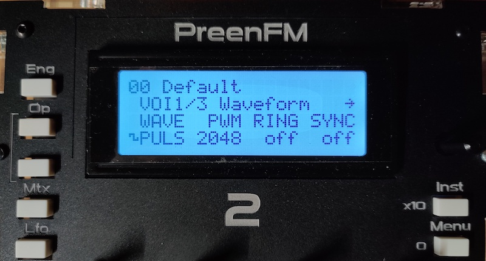

# PreenFM2 meets SID

What is it? A (emulated) SID synth playable via MIDI running on the PreenFM2 hardware platform.

Coming from BBC, Amstrad CPC and Atari ST I never really got into the details of the SID chip...

The midibox SID projects were tempting me but I also had a spare [PreenFM2](https://ixox.fr/preenfm2/) with an older PCB revision lying around -- that and a few "I wonder ifs..." and this happened. 

Basic features include:

- Polyphonic or unison mode
- All SID parameters should be editable
- Basic wavetables for waveform and pitch (although currently no editor)
- 3 LFOs with shape, rate, reset-on-key-pressed
- Modulation targets with selectable LFO and depth: osc frequency, PWM, filter frequency, resonance
- Glide (unison only)
- Switch between 6581 and 8580 emulation
- Runs at 44.1Khz on the 168MHz stm32f405 (see below)

Bonus features:

- ASID support over MIDI (switches on automatically on matching sysex)
- There's a SID file player that can play from a memory buffer. There's currently no (easy) way to get files in though.

## Caveats

- It's only been run on my PreenFM2 R4 PCB with a LCD, i.e. "works for me".
- No support for the original bootloader. Or any bootloader, it gets flashed via SWD.
- It wasn't _necessary_ to implement a MIDI parser but I had some knowledge gaps to fill.
- DIN MIDI only.
- The UI is ad hoc, so it's mostly functional but not "designed".
- Some parameter ranges are just "first guess" so probably need some tweaking.
- Similarly modulation is still at the "basically works" stage but needs to be made more consistent.
- "tests" are mostly some plausibility checks.
- Bugs.

In summary it's more of a technical exercise with a (or yet another?) uninspired repo name, rather than anything approaching a "product" or even a proper "alt firmware" :)

## SID Emulation

- Based on the "ancient" reSID version 0.16. This still seems "Good Enough" and while the following versions are much improved the footprint is bigger. Part of that c/should be `constexpr`-able with some effort but 16MB tables are out for sure :)
- Modifications to reSID were made to get it compiling and (eventually) strip out some unused functionality. Ideally they won't conflict _too_ much with the upstream and are isolated commits.
- There are of course other SID implementations, e.g. I particularly like [chips](https://github.com/floooh/chips). Similarly, there are forks/mirrors of reSID, e.g. libsidplayfp.
- In order to simplify things, the code writes a batch registers at once, then calls `clock` later to generate a block of samples.
- While this works, it isn't how hardware with a bus functions. Ideally (?) the register write/clock might be suitably interleaved (difficulty: output sample interpolation).
- This is maybe a "to investigate"?
- There's a caching layer to only write dirty registers through to the emulation.

So yes, this project is a super convoluted way of writing a few 8-bit registers :)

## General Miscellany

- Some sample rates and smaller block sizes appeared to produce clicking on the output; might be an interpolation artefact or just underrun?
- The "ADSR delay bug" is emulated. This could be made optional.

## TODO-dilly-do

(In no particular order)
- clang-tidy, sanitizers (pending clang support in `stm32x`)
- Support 2 chips/instances of `reSID::SID`. May require smaller blocksize and/or sample rate adjustments but we're at ca. 50% load with one instance, so it "should work". Overclocking is also an option.
- Bump modulator update rate (currently ca. 1.3Khz). May also benefit from smaller block size.
- Arpeggiator
- Wavetable editor (and/or sysex uploads)
- Web editor?
- Patches
- Sysex
- CC
- USB
- Support preenfm2 bootloader?

## Derp
- To `float` or not to `float` seems to be a hard question :)
- In any case, the mixed case seems to be the worst option because rounding is expensive. So this code tends towards fixed-point ops. Which, given the topic seems mostly appropriate anyway...
