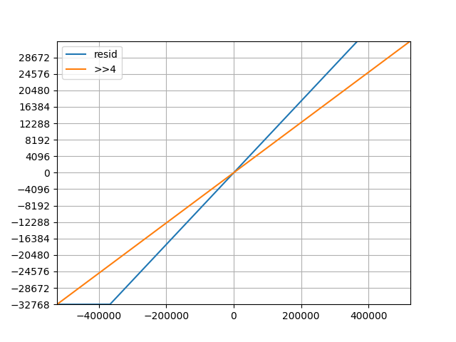

# Misc Implemenation Notes

## reSID
- All the resampling methods are disabled since anything but `SAMPLE_FAST` takes "too long" (at least in a first test)
- Newer implementations (i.e. above 1.x) have a more streamlined output sample generation, but other drawbacks...

### Output value ranges
For one thing, this magic computation in `SID::output()` seems to be gone, or at least folded in to the rest of the improvements like the DAC modelling.
```
  int output_sample = extfilt.output()/((4095*255 >> 7)*3*15*2/range);
```
This works out as `extfilt.output()/11` for the default 16-bit range. My guess is that the full range of the source 20 (20.5?) bits are seldom used, so this is leaving more range than the simple `>>4` and just risks hard clipping some extremes.



In this use case we might prefer an 18-bit value anyway and have floats available, so it may be simplified to just output the _raw_ value and we'll post-process it later, e.g. soft clipping. This also avoids moving platform-specifics like `__SSAT` into the reSID code.
